1. AndroidStudio下载与安装，请按照官网文档：
https://developer.android.google.cn/studio/index.html?utm_source=androiddevtools.cn&utm_medium=website
2. 安装完成后，打开AndroidStudio，会看到如下页面，点击右下角Configure -> SDK Manager：
 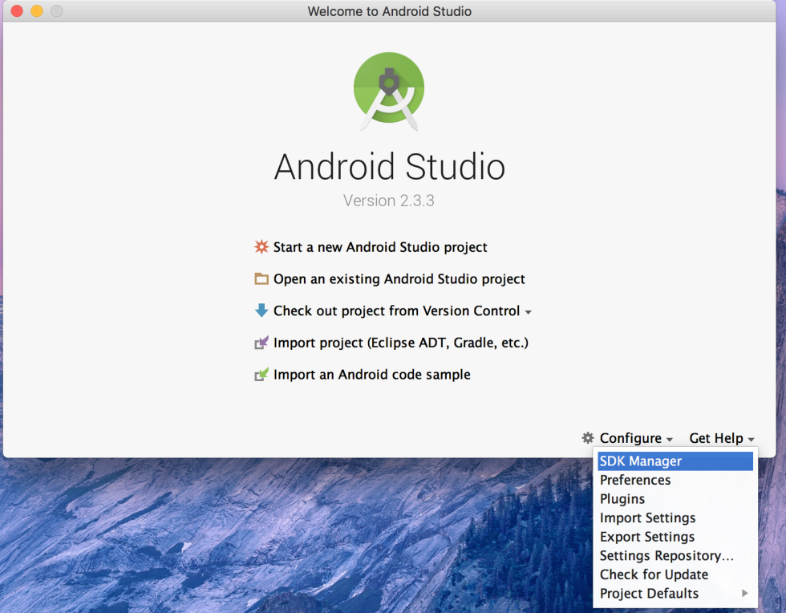
3. 下载Android7.1.1的SDK、NDK以及其他的Tools，仅需要勾选下图中选中的蓝色行，全部选中后，点击``ok -> Accept``，静静等待安装完成（注意Android SDK Location的路径）：
  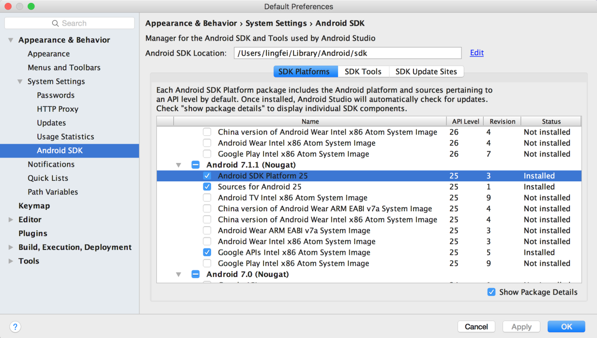
  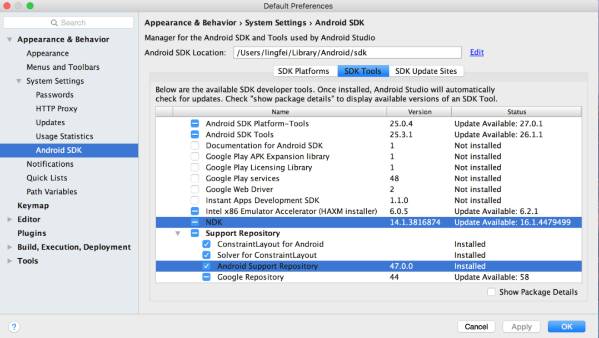
  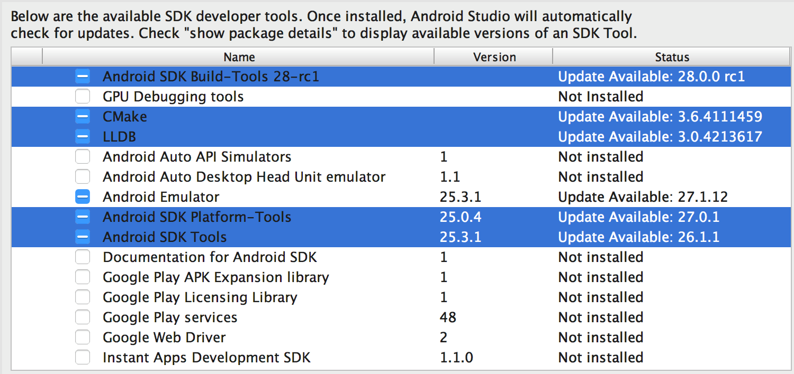
  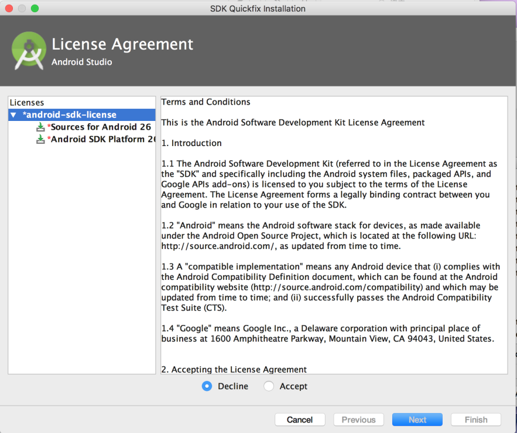
  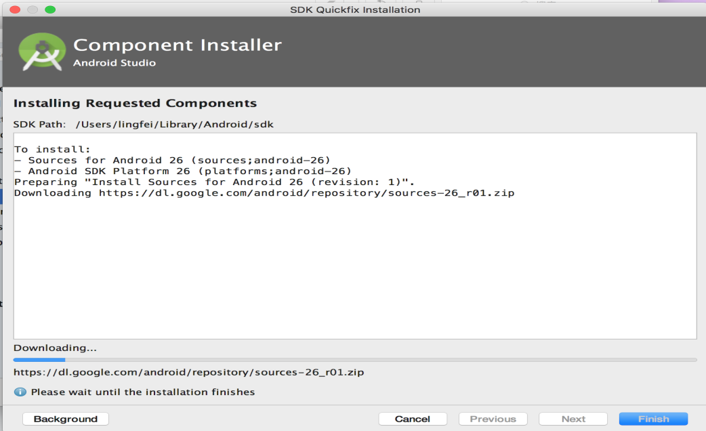
 
4. 检查jdk是否已经安装：
* 打开Terminal，输入 ``java -version``，如下图说明已经安装好了:
  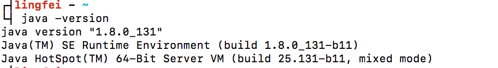
* 若未安装，则按照下面的链接安装：
http://www.cnblogs.com/quickcodes/p/5127101.html
5. gradle下载，且解压到相关路径：
https://services.gradle.org/distributions/gradle-3.3-all.zip
6. 配置jdk、gradle环境变量，请参考jdk环境变量的配置：
* http://www.cnblogs.com/quickcodes/p/5398709.html
* 将gradle解压缩的路径配置成环境变量，如：
```java
export GRADLE_HOME=~/gradle/gradle-3.3-all/
export PATH=$JAVA_HOME/bin:$GRADLE_HOME/bin:$PATH
```
* 打开Terminal，输入``gradle -v``，如下图说明gradle已经配置成功：
  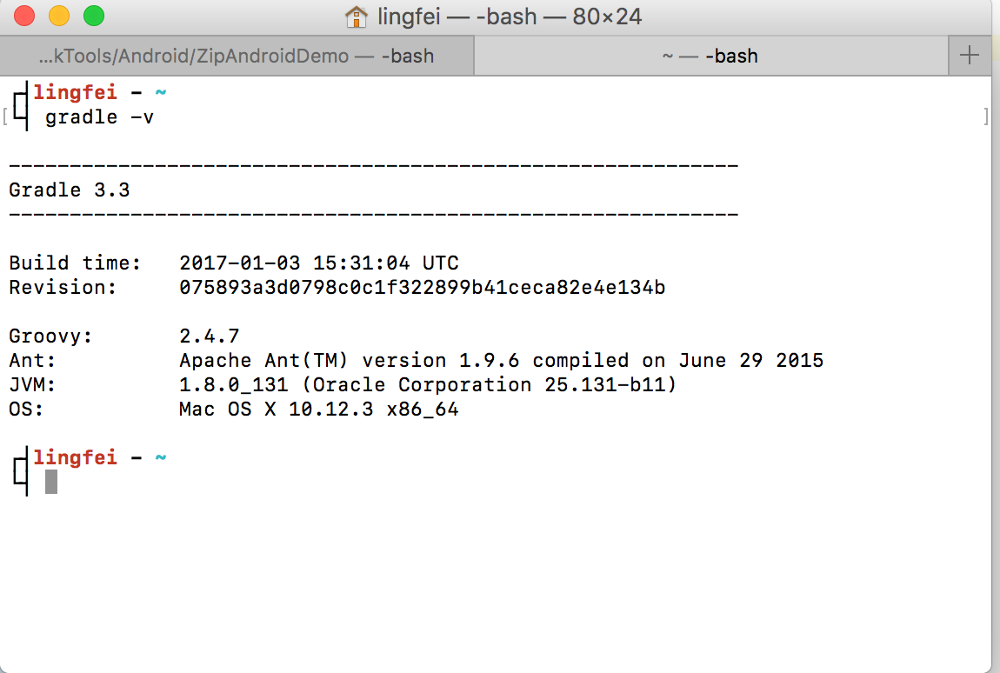
7. 修改项目中相关文件：
（1）sdk及相关tools下载完成，查看各自的版本号：
*  查看build-tool的版本号：
  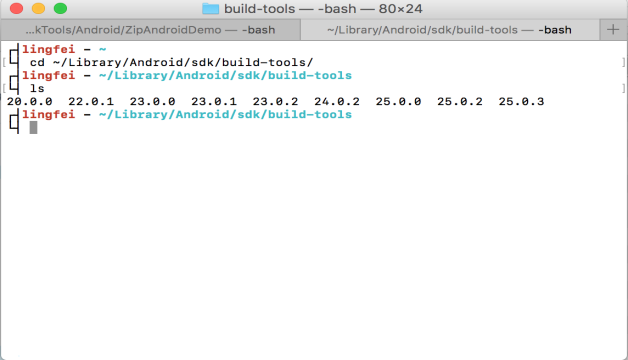
* 查看appcompat-v7的版本号：
  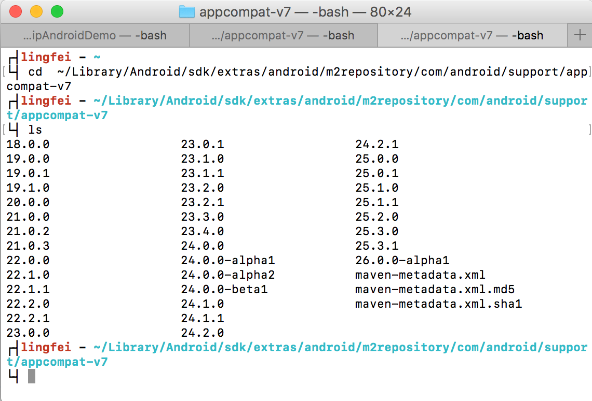

（2）修改Android项目文件build.gradle内容：
* 在Android项目中，找到该路径所在文件：
``ProjectName/app/build.gradle``
* 根据上一步查找到的build-tool的版本号，修改buildToolsVersion字段后面的数字，如下图：
  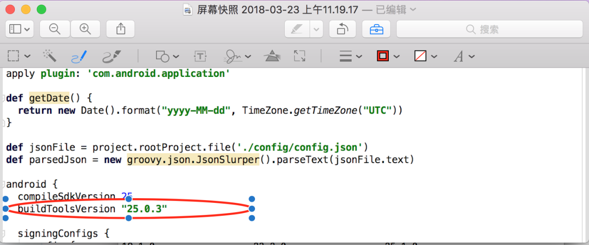
* 根据上一步查找到的appcompat-v7的版本号，修改appcompat-v7字段后面的数字，如下图：
 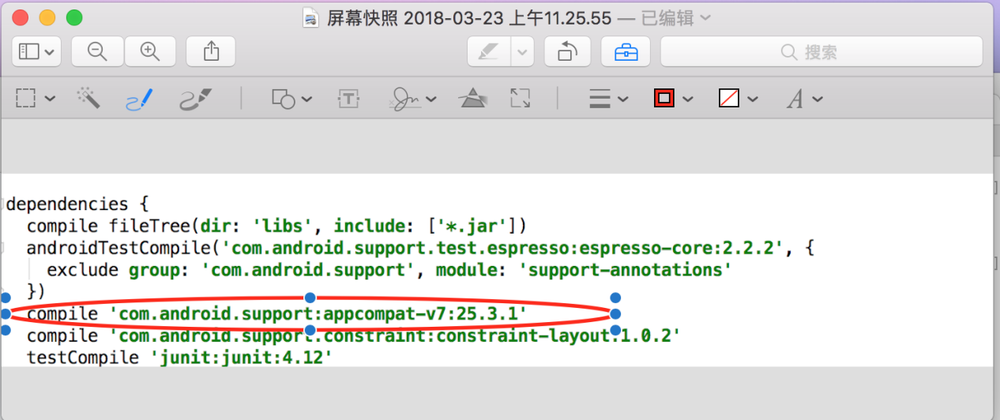
 
（2）修改Android项目文件local.properties内容：
* 在Android项目中，找到该路径所在文件：
``ProjectName/local.properties``
* 根据下载的SDK路径，修改该文件内容，如：
 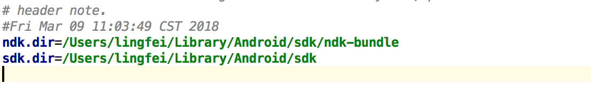
 

